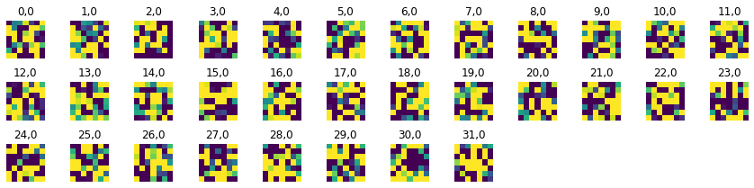
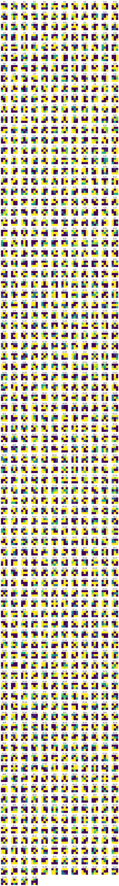

# Attention Sampling Network
Please run the Python notebook to run our implementation of the Attention sampling network.

The notebook expects the following files to be present in while running.
- train.npl
- test.npl
- parameters.json

Visualization of the feature network.

